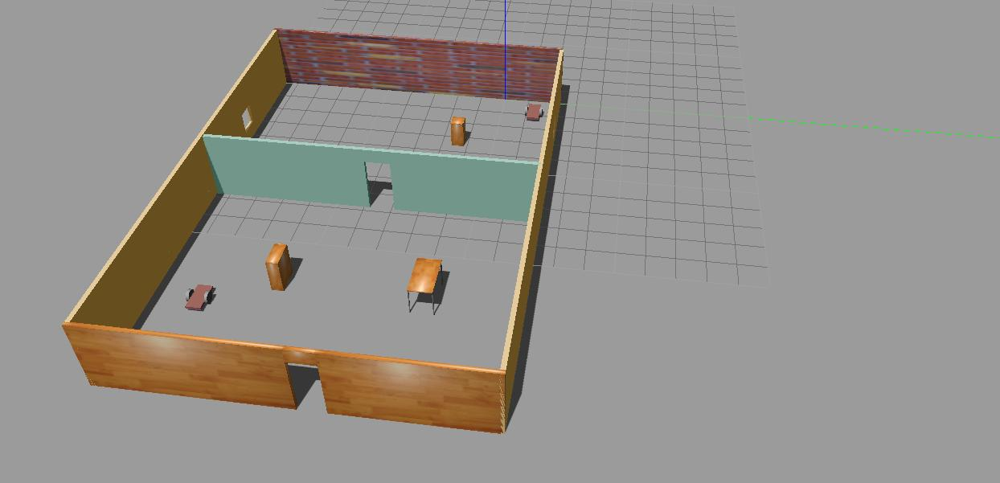
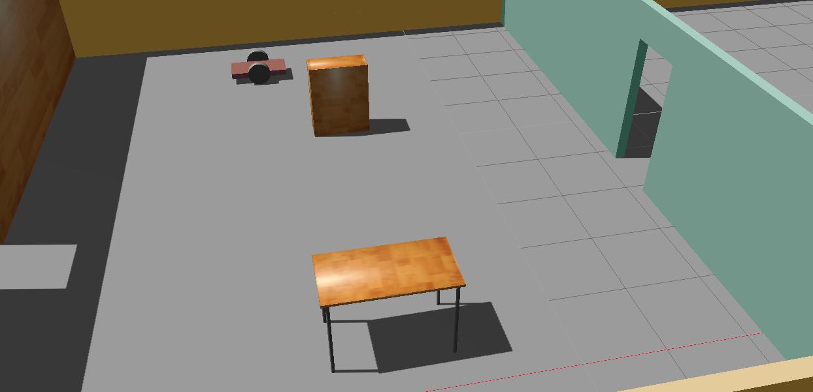

# RoboND-BuildMyRobot
	Project library of the first project of udacity nanodegree program Robotics Software Engineer.
 
## Setup

Involves the updation of ubuntu with the command given below:
	sudo apt-get update
    
After updation, launch the world with the following commands:
    
	mkdir build
   		cmake .. && make
   		gazebo myworld
 
## Implementation

This workspace is completely developed with gazebo simulator. Screenshots are attached below:
 

